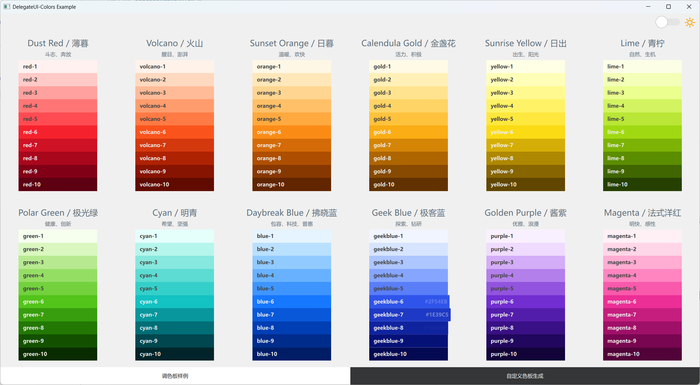
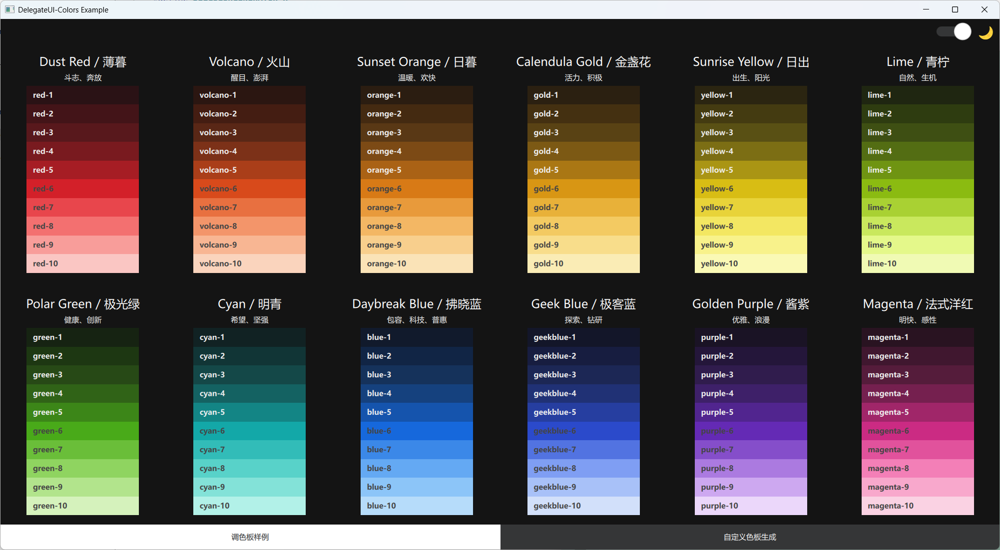

<h1 align="center">DelegateUI Colors</h1>

<div align="center">

🎨 调色板计算器 { 实现来自Ant-d }

</div>

<div style="border: 1px solid #FF4C52;"></div>
<div style="border: 1px solid #BAE637;"></div>
<p style="border: 1px solid #3F95FF;"></p>





## 构建

使用 `cmake`

```sh
  mkdir build && cd build
  cmake ..
  cmake --build .
```

## 如何使用

`c++`

```c++
    #include "delcolorgenerator.h"
    ...
    // 基于预置色生成色板
    auto colors = DelColorGenerator::generate(DelColorGenerator::Preset::Preset_Red, window.light, window.
    light? "#f0f0f0" : "#141414")
```
`colors: [#fff1ef,#ffcac7,#ffa19e,#ff7575,#ff4c52,#f5222d,#cf1225,#a9071c,#820016,#5c0012]`

### 许可证

   使用 `MIT LICENSE`

### 开发环境

  Windows 11，Qt 5.15.2 / Qt 6.7.3